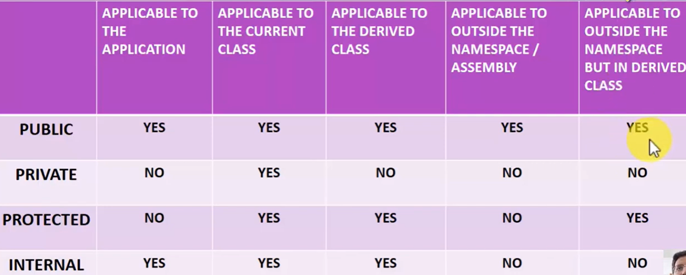

# C# Access Modifiers (Access Specifiers)

Access Modifiers control **who can access classes, variables, methods,
and properties** in a C# application.

They are very important for **Encapsulation and Security** in
Object-Oriented Programming.

------------------------------------------------------------------------

# Types of Access Modifiers in C

1.  Public
2.  Private
3.  Protected
4.  Internal
5.  Protected Internal
6.  Private Protected

------------------------------------------------------------------------

# Default Behavior

## Default for Class Members

If no access modifier is specified for **variables, methods, or
properties**, the default is:

`private`

Example:

``` csharp
class Employee
{
    int salary; // private by default
}
```

------------------------------------------------------------------------

## Default for Classes

If no access modifier is specified for a **class**, the default is:

`internal`

Example:

``` csharp
class Employee
{
}
```

This class is **internal by default**.

------------------------------------------------------------------------

# 1. Public

A **public member** can be accessed **from anywhere in the
application**.

### Real-Life Example

If you post something on social media in **Public mode**, anyone can see
it: - Your friends - Friends of friends - People outside your friend
list

Similarly, a **public member has no access restriction**.

### Accessible From

-   Same class
-   Derived (child) class
-   Other classes in same namespace
-   Other classes in different namespaces
-   Other assemblies (projects)

### Example

``` csharp
public class Employee
{
    public string Name;
}
```

------------------------------------------------------------------------

# 2. Private

A **private member** can only be accessed **inside the class where it is
declared**.

Even **derived classes cannot access it**.

### Accessible From

-   Same class ✔
-   Derived class ❌
-   Other classes ❌

### Example

``` csharp
class Employee
{
    private int salary;
}
```

------------------------------------------------------------------------

# 3. Protected

A **protected member** can be accessed:

-   inside the same class
-   inside derived (child) classes

A derived class **can be in a different namespace** and still access
protected members.

### Accessible From

-   Same class ✔
-   Derived class (same namespace) ✔
-   Derived class (different namespace) ✔
-   Other non-derived classes ❌

### Example

Parent class:

``` csharp
namespace ProjectA
{
    public class Parent
    {
        protected int salary = 50000;
    }
}
```

Child class in another namespace:

``` csharp
using ProjectA;

namespace ProjectB
{
    class Child : Parent
    {
        public void Show()
        {
            Console.WriteLine(salary); // accessible
        }
    }
}
```

------------------------------------------------------------------------

# 4. Internal

An **internal member** is accessible **only within the same assembly
(project)**.

### Accessible From

-   Same class ✔
-   Derived class ✔
-   Other classes in same project ✔
-   Different project ❌

### Example

``` csharp
internal class Employee
{
    internal int salary;
}
```

------------------------------------------------------------------------

# 5. Protected Internal

`protected internal` is a **combination of protected and internal**.

Accessible if:

-   It is in the **same assembly (project)**\
    OR
-   It is in a **derived class (even in another assembly)**

### Example

``` csharp
class Employee
{
    protected internal int salary;
}
```

------------------------------------------------------------------------

# 6. Private Protected

`private protected` is accessible only:

-   inside the same class
-   inside derived classes **within the same assembly**

### Example

``` csharp
class Employee
{
    private protected int salary;
}
```

------------------------------------------------------------------------

# Quick Summary Table



# Class-Level Modifiers

Only two modifiers are allowed for classes:

-   public
-   internal

Example:

``` csharp
public class Employee
{
}

internal class Manager
{
}
```

------------------------------------------------------------------------

# Interview Tips

1.  Default member access modifier is **private**
2.  Default class access modifier is **internal**
3.  `protected` allows access **through inheritance**
4.  `internal` restricts access to **same assembly**
5.  `protected internal` = **same assembly OR derived class**
6.  `private protected` = **same assembly AND derived class**

------------------------------------------------------------------------

# Simple Memory Trick

Private → Only me
Protected → Me + My children
Internal → My project
Public → Everyone

------------------------------------------------------------------------

# Example Combining Multiple Modifiers

``` csharp
public class Employee
{
    public string Name;
    private int salary;
    protected int bonus;
    internal int departmentId;
    protected internal int level;
    private protected int secretCode;
}
```
