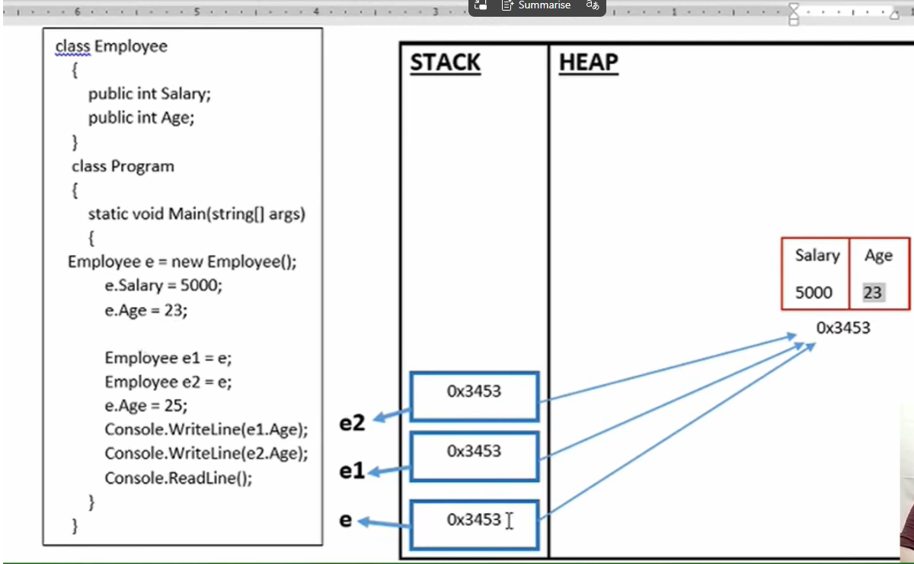

# C# Memory Concepts -- Stack vs Heap (Reference Types Example)

This document explains how **reference types (classes)** behave in
memory and why the .NET runtime uses **stack and heap memory** for
efficient memory management.

------------------------------------------------------------------------

# Example Code

``` csharp
class Employee
{
    public int Salary;
    public int Age;
}

class Program
{
    static void Main(string[] args)
    {
        Employee e = new Employee();
        e.Salary = 5000;
        e.Age = 23;

        Employee e1 = e;
        Employee e2 = e;

        e.Age = 25;

        Console.WriteLine(e1.Age);
        Console.WriteLine(e2.Age);

        Console.ReadLine();
    }
}
```

------------------------------------------------------------------------

# Step‑by‑Step Memory Explanation

## Step 1

``` csharp
Employee e = new Employee();
```

When this line executes:

1.  A **reference variable `e` is created in the stack**
2.  A new **Employee object is created in the heap**
3.  The stack variable stores the **memory address of the heap object**

Example:

    STACK
    -----
    e → 0x3453

    HEAP
    ----
    Employee Object
    Salary : 0
    Age    : 0

------------------------------------------------------------------------

## Step 2

``` csharp
e.Salary = 5000;
e.Age = 23;
```

Values are stored inside the **heap object**.

    HEAP
    -----------------
    Employee Object
    Salary : 5000
    Age    : 23

------------------------------------------------------------------------

## Step 3

``` csharp
Employee e1 = e;
```

This **copies the reference**, not the object.

    STACK
    ------
    e  → 0x3453
    e1 → 0x3453

Both variables now point to the **same heap object**.

------------------------------------------------------------------------

## Step 4

``` csharp
Employee e2 = e;
```

Now there are **three references pointing to the same object**.

    STACK
    ------
    e  → 0x3453
    e1 → 0x3453
    e2 → 0x3453

------------------------------------------------------------------------

## Step 5

``` csharp
e.Age = 25;
```

Because all variables point to the **same object**, the change is
reflected everywhere.

    HEAP
    -----------------
    Employee Object
    Salary : 5000
    Age    : 25

------------------------------------------------------------------------


# Program Output

    25
    25

Because all variables reference the **same heap object**.

------------------------------------------------------------------------

# Advantages of Stack and Heap Memory Usage

Using stack and heap memory appropriately helps in **efficient memory
management**.

------------------------------------------------------------------------

## Stack Memory

Small variables such as **value types (int, struct, bool, etc.)** are
usually stored in the **stack**.

Advantages:

-   Faster memory allocation and deallocation
-   Automatically managed by the runtime
-   No garbage collection required
-   Ideal for small and short‑lived data

Example:

    int age = 23;

------------------------------------------------------------------------

## Heap Memory

Large objects such as **class instances, arrays, and complex objects**
are stored in the **heap**.

Advantages:

-   Suitable for large data structures
-   Objects can be shared across multiple references
-   Lifetime can extend beyond the current method scope

Example:

    Employee e = new Employee();

Here:

-   The **reference variable** `e` is stored in the **stack**
-   The **actual object** is stored in the **heap**

------------------------------------------------------------------------

# Key Idea

The runtime uses:

-   **Stack for small and temporary data**
-   **Heap for larger and shared objects**

This separation improves:

-   Performance
-   Memory management
-   Application stability

------------------------------------------------------------------------

# Interview One‑Line Answer

> Stack memory is used for small and short‑lived variables because it is
> faster, while heap memory is used for larger objects that need a
> longer lifetime or shared access.
