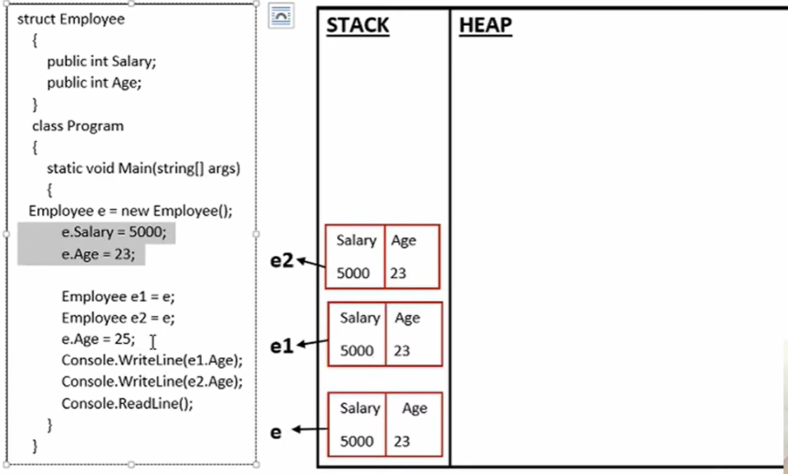

# C# Value Type Example (Struct Memory Behavior)

This document explains how **structs (value types)** behave in C# memory
using **stack allocation and value copying**.

------------------------------------------------------------------------

## Example Code

``` csharp
struct Employee
{
    public int Salary;
    public int Age;
}

class Program
{
    static void Main(string[] args)
    {
        Employee e = new Employee();
        e.Salary = 5000;
        e.Age = 23;

        Employee e1 = e;
        Employee e2 = e;

        e.Age = 25;

        Console.WriteLine(e1.Age);
        Console.WriteLine(e2.Age);

        Console.ReadLine();
    }
}
```

------------------------------------------------------------------------

# Key Concept

`struct` in C# is a **Value Type**.

Value types store **actual data directly in memory**, and when assigned
to another variable **a copy of the data is created**.

This means:

-   Each variable has **its own independent copy**
-   Changes to one variable **do NOT affect the others**

------------------------------------------------------------------------

# Memory Diagram



------------------------------------------------------------------------

# Step-by-Step Explanation

## Step 1

``` csharp
Employee e = new Employee();
```

Since `Employee` is a **struct**, memory is allocated inside the **stack
frame of the Main method**.

Initial state:

    STACK
    -----------------
    e
    Salary : 0
    Age    : 0

------------------------------------------------------------------------

## Step 2

``` csharp
e.Salary = 5000;
e.Age = 23;
```

Values inside the struct are updated.

    STACK
    -----------------
    e
    Salary : 5000
    Age    : 23

------------------------------------------------------------------------

## Step 3

``` csharp
Employee e1 = e;
```

Because `Employee` is a **value type**, the entire struct is **copied**.

    STACK
    -----------------
    e1
    Salary : 5000
    Age    : 23
    
    e
    Salary : 5000
    Age    : 23    

Now there are **two independent copies**.

------------------------------------------------------------------------

## Step 4

``` csharp
Employee e2 = e;
```

Another copy is created.

    STACK
    -----------------
    e2
    Salary : 5000
    Age    : 23
    
    e1
    Salary : 5000
    Age    : 23
    
    e
    Salary : 5000
    Age    : 23

    

Each variable now has **separate memory**.

------------------------------------------------------------------------

## Step 5

``` csharp
e.Age = 25;
```

Only `e` is modified.

    STACK
    -----------------
    e2
    Salary : 5000
    Age    : 23
    
    e1
    Salary : 5000
    Age    : 23
    
    e
    Salary : 5000
    Age    : 25  

    

Because `e1` and `e2` were **copied earlier**, their values remain
unchanged.

------------------------------------------------------------------------

# Program Output

    23
    23

------------------------------------------------------------------------

# Important Notes for Interviews

## Struct is a Value Type

Structs store **actual data**, not references.

Assignment creates a **copy of the entire object**.

------------------------------------------------------------------------

## Value Types Are Usually Stored in Stack

In this example:

    STACK
    -----------------
    e2
    el
    e


No heap allocation occurs because **no class objects are created**.

------------------------------------------------------------------------

## Stack Behavior

Stack follows **LIFO (Last In First Out)**.

Example:

    Push A
    Push B
    Push C

    Pop -> C
    Pop -> B
    Pop -> A

It is **not FIFO**.

------------------------------------------------------------------------


**Interview One-Liner:**

> Structs are value types in C#. Assigning one struct to another creates
> a full copy of the data, so each variable holds its own independent
> value.
